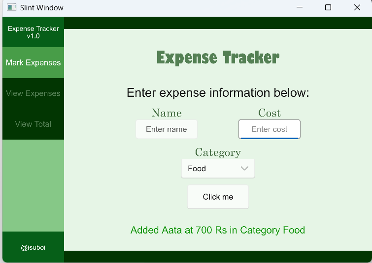

It's an expense tracking application written in Rust.
The UI is written in Slint.

To run this, git clone it into your directory.
Use cargo run.

Features include: 
1) Adding 
    - Item Name, Cost and Category
2) Viewing Details
    - Viewing individual items added so far.
    - Editing item details and saving them
    - Cancelling any edits made before saving.
    - Items categorized and displayed as per color of the specific category.
3) Viewing Summary and Total
    - Viewing complete total of all expenses.
    - Viewing total for each individual category.
    - Color coded categories.

Following is screenshot of the home page:

In case only partial input is entered: 

When all inputs are filled and submitted correctly!

This is the screenshot of view page that shows all the expenses added so far.

It is possible to edit the Item Name and Item Cost from the view page itself.

It is also possible to change the category of the item/expense

Finally, it is possible to view complete total expense and individual category expenses
